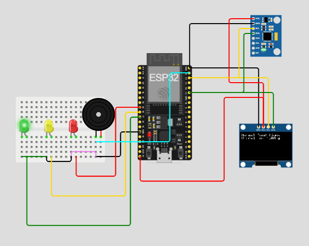

# ESP32 Earthquake Detector


Developed an ESP32-based earthquake detection system as part of an Internet of Things (IoT) course, utilizing an MPU6050 accelerometer with an OLED display, LEDs, and a buzzer to monitor vibrations and provide real-time visual and audio alerts for potential seismic activity.

---

## Features

- Detects vibrations using the MPU6050 accelerometer
- Displays status on an OLED screen
- LED warning indicators:
  - 🟢 Green → Normal conditions
  - 🟡 Yellow → Moderate vibration
  - 🔴 Red → Earthquake detected
- Buzzer alarm for strong vibrations
- Real-time vibration monitoring

---

## Hardware

- ESP32
- MPU6050 accelerometer/gyroscope
- SSD1306 OLED display
- LEDs (green, yellow, red)
- buzzer
- breadboard and jumper wires

---

## Simulation

You can run the project directly in Wokwi:

https://wokwi.com/projects/430801700714726401

---

## Project Structure

```
esp32-earthquake-detector
│
├ src
│   └ sketch.ino
│
├ hardware
│   └ diagram.json
│
├ docs
│   └ circuit.png
│
├ libraries.txt
├ wokwi-project.txt
└ README.md
```

---

## Libraries

This project uses the following libraries:

- Adafruit GFX
- Adafruit SSD1306
- Adafruit MPU6050
- MPU6050_light

Install them using the Arduino Library Manager.

---

## How It Works

1. The MPU6050 sensor reads acceleration values on the X, Y, and Z axes.
2. The ESP32 calculates the total vibration level.
3. Based on the vibration threshold:
   - Green LED indicates normal conditions
   - Yellow LED indicates moderate vibrations
   - Red LED and buzzer indicate possible earthquake activity
4. The vibration level and system status are displayed on the OLED screen.

---

## License

MIT License
